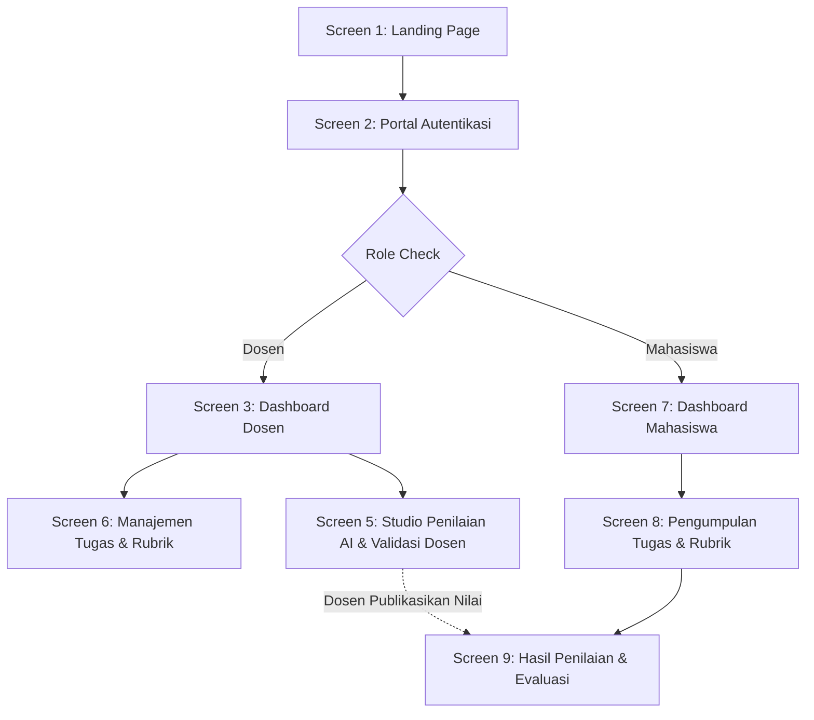

# 📋 Product Requirement Document (PRD) & Project Brief
# Dexa Assessment — Modern LMS Collaboration Hub & Intelligent Evaluation Platform

**Project ID (Stitch):** `10357375543154450150`  
**Brand Name:** **Dexa Assessment** *(sebelumnya AI Assessment Copilot)*  
**Version:** `1.0.0`  
**Status:** `Active / Fully Implemented & Deployed`  
**Target:** Capstone Project, Pendidikan Tinggi & Vokasi  

---

## 1. Executive Summary & Project Brief

### 1.1 Latar Belakang & Masalah
Di perguruan tinggi dan institusi pendidikan vokasi, dosen pengajar menghabiskan sebagian besar waktunya (hingga 60–70% waktu administrasi akademik) untuk mengoreksi tugas esai, analisis kasus, dan laporan praktikum secara manual. Kendala utama yang dihadapi meliputi:
1. **Beban Waktu Evaluasi Tinggi**: Mengoreksi puluhan hingga ratusan dokumen mahasiswa membutuhkan waktu berhari-hari sehingga umpan balik sering kali terlambat diterima mahasiswa.
2. **Inkositensi Penilaian**: Koreksi manual rentan terhadap kelelahan pemeriksa, yang berpotensi menghasilkan standar evaluasi yang tidak seragam antar-mahasiswa.
3. **Umpan Balik yang Minim**: Karena keterbatasan waktu, dosen kerap hanya memberikan nilai angka tanpa elaborasi umpan balik konstruktif yang memadai.
4. **Resistensi terhadap AI Penuh (Black-Box AI)**: Penilaian otomatis penuh tanpa campur tangan manusia menimbulkan kekhawatiran etis, hilangnya nuansa akademik, dan ketidakpercayaan mahasiswa.

### 1.2 Solusi: Dexa Assessment (Modern LMS Collaboration Hub)
**Dexa Assessment** adalah platform LMS generasi baru dengan filosofi inti **Human-in-the-Loop (HITL)**. Platform ini menggabungkan kemudahan kolaborasi kelas modern (mirip Google Classroom & Microsoft Teams) dengan kecerdasan buatan Google Gemini 2.0 Flash sebagai asisten pemeriksa objektif. 

> **Prinsip Utama Human-in-the-Loop (HITL)**:  
> AI bertindak sebagai **Copilot / Asisten Pemeriksa** yang menganalisis kesesuaian dokumen jawaban dengan rubrik berbobot, lalu menghasilkan draft rekomendasi skor dan narasi umpan balik. **Dosen pengajar memegang kendali 100%** untuk meninjau, menggeser nilai skor (override), menyunting catatan evaluasi, dan mengesahkan nilai final.

---

## 2. Target Pengguna & User Personas

### 2.1 Persona 1: Dosen Pengajar (Educator / Evaluator)
- **Kebutuhan**: 
  - Membuat dan mengelola kelas dengan kode pendaftaran instan (*enrollment key*).
  - Menyusun rubrik penilaian berbobot dinamis (total otomatis 100%).
  - Membuka penugasan dengan tenggat waktu dan format submission fleksibel (PDF/DOCX/Teks).
  - Memeriksa puluhan jawaban mahasiswa dalam hitungan menit di **Studio Penilaian AI**.
  - Mengesahkan dan mempublikasikan nilai final secara transparan.

### 2.2 Persona 2: Mahasiswa (Student / Learner)
- **Kebutuhan**:
  - Bergabung ke kelas dosen menggunakan kode pendaftaran kelas.
  - Membaca instruksi tugas dan transparansi kriteria rubrik penilaian sebelum mengumpulkan.
  - Mengunggah berkas jawaban dengan indikator progress upload yang jelas.
  - Melihat riwayat pengumpulan, status verifikasi dosen, dan umpan balik konstruktif per-kriteria rubrik.

---

## 3. Arsitektur Layar (Stitch Screen Mapping)

Dexa Assessment mengimplementasikan 9 layar inti dari rancangan **Modern LMS Collaboration Hub**:

### Rincian 9 Layar:
1. **Screen 1: Landing Page (`87455ffd46bd4e0f91c0a848641174b3`)**  
   - Rute: `/`
   - Hero section, showcase live grading simulator, penjelasan filosofi HITL, perbandingan sebelum vs sesudah, call to action.
2. **Screen 2: Login & Portal Autentikasi (`3cc122f5fbdf4c73b02d744a4cefc196`)**  
   - Rute: `/login` & `/register`
   - Pemilihan peran (Dosen / Mahasiswa), validasi form Zod, tombol 1-klik kredensial demo untuk evaluasi cepat.
3. **Screen 3: Dashboard Utama Dosen (`ae1aa623ac8d48d7838e9902bbb508da`)**  
   - Rute: `/classes`
   - Statistik kelas aktif, jumlah tugas menunggu verifikasi dosen, kartu kelas dengan tombol salin & regenerasi *enrollment key*, modal buat kelas.
4. **Screen 4: Design System (`asset-stub-assets_cd5d9b30c477407bb51d8a7afcfad6b3`)**  
   - Konfigurasi: `globals.css`
   - Token palet warna (Indigo Primary, Violet AI Copilot, Emerald Finalized, Slate Neutrals), radius modern, micro-interactions, responsive fluid typography.
5. **Screen 5: Studio Penilaian AI & Validasi Dosen (`3de759bb926442a08b326d3f57219d80`)**  
   - Rute: `/classes/[id]/assignments/[id]/submissions/[id]`
   - Split-pane studio: Ekstraksi teks dokumen di panel kiri; real-time SSE streaming rekomendasi AI, slider override nilai rubrik, textarea umpan balik naratif, dan tombol finalisasi di panel kanan.
6. **Screen 6: Manajemen Tugas & Pembangun Rubrik (`ce70711b660849b294f7be0f30885d77`)**  
   - Rute: `/classes/[id]/rubrics` & `/classes/[id]/assignments/new`
   - Rubric builder multi-kriteria dengan verifikasi kalkulasi bobot otomatis 100%, preset template (Esai, Coding, Praktikum), dan pembuat penugasan baru.
7. **Screen 7: Dashboard Mahasiswa (`16b60146afbd4361b5ccdde3e5a3cfc2`)**  
   - Rute: `/classes` (tampilan Mahasiswa)
   - Daftar kelas yang diikuti, modal gabung kelas dengan kode pendaftaran, daftar tugas mendatang, dan badge status tugas.
8. **Screen 8: Pengumpulan Tugas & Rubrik Transparan (`09385b1d90b64648bf4955c54db09e38`)**  
   - Rute: `/classes/[id]/assignments/[id]`
   - Preview kriteria rubrik sebelum submit, drag-and-drop file uploader (PDF/DOCX) dengan XHR progress bar riil, riwayat revisi pengumpulan.
9. **Screen 9: Hasil Penilaian & Evaluasi Transparan (`14de1b32651e44f6bebdf44600c583c5`)**  
   - Rute: `/classes/[id]/assignments/[id]/result`
   - Skor final terverifikasi dosen, rincian nilai per kriteria rubrik, catatan kelebihan & area perbaikan dari dosen, badge validasi resmi.

---

## 4. Spesifikasi Teknis & Arsitektur Sistem

### 4.1 Tech Stack
- **Framework Web**: Next.js 15 (App Router, Server Components & Server Actions)
- **Bahasa**: TypeScript (Strict Mode)
- **Database & ORM**: PostgreSQL (Neon Serverless Cloud Database) + Prisma ORM
- **Autentikasi**: Auth.js v5 (NextAuth) dengan strategi JWT session & enkripsi kata sandi `bcryptjs`
- **Model Kecerdasan Buatan**: Google Gemini 2.0 Flash (`gemini-2.0-flash`) via `@google/genai`
- **Ekstraksi Dokumen**: `pdf-parse` (PDF) & `mammoth` (DOCX / Microsoft Word)
- **Komunikasi Real-time**: Server-Sent Events (SSE) untuk streaming status proses evaluasi AI
- **Testing & Tooling**: Vitest, Biome Linter/Formatter

### 4.2 Alur Data & Pipeline Evaluasi AI (Human-in-the-Loop)
1. **Pengumpulan Dokumen**: Mahasiswa mengunggah dokumen PDF/DOCX atau teks.
2. **Ekstraksi Teks**: Server mengekstrak teks isi jawaban tanpa merusak format paragraf.
3. **Analisis AI Terpandu**:
   - Sistem merakit prompt terstruktur yang berisi:
     - Instruksi penugasan dosen
     - Daftar lengkap kriteria rubrik beserta bobot (%) dan deskriptor skala nilai
     - Teks jawaban mahasiswa
   - AI menghasilkan evaluasi berformat JSON terverifikasi (skor per kriteria, alasan/rasional penilaian, dan rekomendasi umpan balik konstruktif).
4. **Penyajian Draft (Dosen-Only)**:
   - Hasil AI disimpan dengan status `DRAFT_AI` dan badge violet bergaris putus-putus (*dashed*).
   - Nilai draft **TIDAK** dapat dilihat oleh mahasiswa.
5. **Validasi & Finalisasi Dosen**:
   - Dosen membuka Studio Penilaian, membaca perbandingan teks jawaban dan analisis AI.
   - Dosen dapat menggeser skor jika dirasa kurang pas (*Human Override*).
   - Dosen menekan **"Sahkan & Finalisasi Nilai"**. Status berubah menjadi `FINALIZED` dengan stempel hijau solid.
6. **Transparansi Mahasiswa**:
   - Mahasiswa menerima notifikasi nilai dan dapat melihat breakdown evaluasi resmi dosen.

---

## 5. Keamanan, Integritas & Etika Akademik

1. **Isolasi Data Evaluasi**: Mahasiswa tidak memiliki akses ke raw prompt atau token AI di server; hanya menerima hasil verifikasi resmi dosen.
2. **Enrollment Key Security**: Kode kelas dilindungi hashing dan dosen memiliki kemampuan merotasi/meregenerasi kode kapan pun jika terjadi kebocoran.
3. **Failover Database & API**: Fallback connection string pooler disiapkan secara otomatis sehingga aplikasi tetap handal saat redeploy.
4. **Akuntabilitas Penuh**: Setiap nilai yang dipublikasikan mencatat riwayat apakah disetujui langsung atau di-override oleh dosen pengajar.
